# Universal Dev Container — Claude Code Development Environment

> Reusable Dev Container configuration with integrated Claude Code, firewall, and proxy support.
> ⚠️ **bypassPermissions** enabled by default — see [Security Notice](#security-notice-) for usage restrictions.

**Languages**: [English](README.en.md) | [中文](README.md)

---

## What is This?

A pre-configured development container environment featuring:

- ✅ **Claude Code** — AI programming assistant (pre-configured with login and permissions)
- ✅ **Development Tools** — Node.js (LTS), Python 3.12, GitHub CLI
- ✅ **Network Security** — Whitelist-based egress firewall
- ✅ **Proxy Support** — VPN/Corporate proxy passthrough
- ✅ **Reusable** — One configuration for all your projects

---

## 📋 Quick Reference

<details open>
<summary><b>Common Commands Cheat Sheet</b></summary>

```bash
# Quick Start (Recommended)
/path/to/universal-devcontainer/scripts/open-project.sh /path/to/your/project

# Verify Installation
claude /doctor                    # Check Claude Code status
claude /permissions               # View permissions mode
node -v && python3 --version      # Check development tools

# Troubleshooting
echo $PROJECT_PATH                # Check if project path is set
grep ' /workspace ' /proc/mounts  # Verify workspace mount (inside container)
```

**Key Paths**:
- Your project: `/workspace`
- Tool scripts: `/universal`
- Claude config: `~/.claude/settings.json`

**Quick Jump**:
- [Quick Start](#quick-start-) | [Troubleshooting](#troubleshooting) | [Security Notice](#security-notice-) | [Performance](#-performance-optimization)
</details>

---

## Prerequisites

- VS Code ≥ 1.105 + Dev Containers extension ≥ 0.427
- Docker Desktop running
- (Optional) `npm i -g @devcontainers/cli` — For script assistance

**Restricted Network/Proxy Environment**: Read [Proxy Setup Guide](docs/PROXY_SETUP.md) first

---

## 🏗️ Architecture Overview

```mermaid
graph TB
    subgraph Host["Host Machine"]
        VS["VS Code"]
        Claude_Host["~/.claude/<br/>(Claude Credentials)"]
        Project["Your Project<br/>/path/to/project"]
        Repo["This Repository<br/>universal-devcontainer"]
    end

    subgraph Container["Dev Container"]
        Workspace["/workspace<br/>(Your Project)"]
        Universal["/universal<br/>(Tools & Scripts)"]
        Claude_Container["~/.claude/<br/>(Container Credentials)"]
        Tools["Dev Tools<br/>Node.js, Python, etc."]
        Firewall["Firewall<br/>(Whitelist)"]
    end

    subgraph External["External Services"]
        Claude_AI["Claude AI<br/>api.anthropic.com"]
        GitHub["GitHub<br/>github.com"]
        NPM["NPM Registry<br/>npmjs.org"]
    end

    VS -->|Launches| Container
    Project -->|Read-only Mount| Workspace
    Repo -->|Read-only Mount| Universal
    Claude_Host -->|Read-only Mount<br/>Copy Once| Claude_Container

    Tools -.->|Accesses| Workspace
    Tools -.->|Uses| Universal

    Firewall -->|Allow HTTPS| Claude_AI
    Firewall -->|Allow HTTPS| GitHub
    Firewall -->|Allow HTTPS| NPM
    Firewall -.->|Block Others| External

    style Container fill:#e1f5ff
    style Host fill:#fff4e6
    style External fill:#f3e5f5
    style Firewall fill:#ffebee
```

<details>
<summary><b>View System Architecture</b></summary>



**Key Features**:
- 🔒 **Read-only Mounts**: Host files protected
- 🔑 **Credential Copy**: One-time copy from host to container
- 🛡️ **Firewall**: Whitelist controls all egress traffic
- 🚀 **Tool Isolation**: Container environment doesn't affect host

</details>

---

## Quick Start 🚀

**Choose your approach**:
- **Method 1** (Shared Config): Reuse one config for multiple projects — ideal for temporary development, quick trials
- **Method 2** (Standalone Config): Each project has its own config — ideal for new projects, team collaboration

---

### Method 1: Shared Configuration Mode (Recommended for Temporary Development) ⭐

Use this repository to provide a unified Dev Container environment for multiple projects.

**Quick Start**:
```bash
# 1. Install and login to Claude Code on host (one-time only)
npm i -g @anthropic-ai/claude-code
claude login

# 2. Open container for any project
/path/to/universal-devcontainer/scripts/open-project.sh /path/to/your/project

# Or clone from Git repository and develop directly
/path/to/universal-devcontainer/scripts/open-project.sh https://github.com/owner/repo.git
```

**How it Works**:
1. Script automatically sets `PROJECT_PATH` environment variable
2. VS Code mounts your project to `/workspace` in container
3. This repository tools mounted to `/universal`

<details>
<summary><b>Method 1 Alternatives</b> (without script)</summary>

**Manual Environment Variable**:
```bash
export PROJECT_PATH=/path/to/your/project
code /path/to/universal-devcontainer
# In VS Code: Dev Containers: Reopen in Container
```

**Developing the Container Itself**:
```bash
/path/to/universal-devcontainer/scripts/open-project.sh /path/to/universal-devcontainer
```
</details>

---

### Method 2: Standalone Configuration Mode (Recommended for New Projects) 📦

**Use Case**: Create standalone Dev Container configuration for your own projects

Starting from v2.1.0, this project provides a **Dev Container Template** that allows you to quickly generate configuration for your project without depending on this repository.

**Steps**:

1. Open your project in VS Code
2. Press `Cmd/Ctrl + Shift + P` to open Command Palette
3. Select "Dev Containers: Add Dev Container Configuration Files..."
4. Select "Show All Definitions..."
5. Search and select "Universal Dev Container with Claude Code"
6. Configure options:
   - **Claude Login Method**: `host` (recommended) / `api-key` / `manual`
   - **Enable Firewall**: `true` (default, whitelist-based firewall) / `false`
   - **Strict Proxy Mode**: `true` / `false` (default, force all traffic through proxy)
   - **Timezone**: Your timezone (e.g., `America/New_York`, `UTC`)
   - **Enable Sandbox**: `true` / `false` (default, command sandbox)
   - **Bypass Permissions**: `true` (default, auto-approve) / `false` (require approval)
7. Click "Reopen in Container"

**Template Features**:
- ✅ In-project configuration (`.devcontainer/` directory in your project)
- ✅ Customizable options (configure via UI, no manual editing)
- ✅ Independent (doesn't depend on this repository)
- ✅ Shareable (team members can clone and use directly)

**Manual Configuration** (without UI):

Create `.devcontainer/devcontainer.json` in your project root:

```json
{
  "name": "My Project",
  "image": "ghcr.io/xrf9268-hue/universal-claude:latest",
  "remoteEnv": {
    "PROJECT_PATH": "${localWorkspaceFolder}"
  }
}
```

**Template vs Repository Approach Comparison**:

| Feature | Repository Approach (Method 1-3) | Dev Container Template (Method 4) |
|---------|----------------------------------|-----------------------------------|
| Use Case | Temporary development, shared config | New projects, team collaboration |
| Config Location | This repository | In-project `.devcontainer/` |
| Flexibility | Manual env vars | UI configuration options |
| Dependencies | Requires this repo | Independent (config in project) |
| Updates | git pull this repo | Re-apply template or manual update |

📖 **Template Full Documentation**: See [`src/universal-claude/README.md`](src/universal-claude/README.md)

---

## Verify Installation

After container starts, open terminal and verify:

```bash
# Verify automatic host login reuse
claude /doctor

# Check Claude Code
claude /help
/permissions          # Should show bypassPermissions

# Check development tools
node -v               # LTS version
python3 --version     # 3.12.x (Ubuntu 24.04)
gh --version          # GitHub CLI

# Check proxy (if configured)
env | grep -i proxy
nc -vz host.docker.internal 1082  # Test host proxy connectivity
```

---

## Environment Variable Configuration

### Login and Organization Configuration (Optional)

By default, as long as you've run `claude login` on the host, the container will copy login configuration from host `~/.claude/settings.json` to the container during initialization. Generally **no additional environment variables needed**.

To override login method or use pure API Key mode, set:

| Variable | Description | Example |
|----------|-------------|---------|
| `CLAUDE_LOGIN_METHOD` | Login method: `console`/`claudeai`/`apiKey` | `console` |
| `ANTHROPIC_API_KEY` | API Key (required for `apiKey` method) | `sk-ant-xxx...` |

Set on host (container will automatically read):

```bash
# Method 1: Environment variables
export CLAUDE_LOGIN_METHOD=console
export ANTHROPIC_API_KEY=sk-ant-...

# Method 2: VS Code settings.json
// ~/.config/Code/User/settings.json
{
  "dev.containers.defaultEnv": {
    "CLAUDE_LOGIN_METHOD": "console",
    "ANTHROPIC_API_KEY": "sk-ant-..."
  }
}
```

---

### Optional Variables

| Variable | Description | Default | Example |
|----------|-------------|---------|---------|
| `CLAUDE_ORG_UUID` | Force use of specific organization | - | `org-xxx...` |
| `HOST_PROXY_URL` | Host HTTP/HTTPS proxy | - | `http://host.docker.internal:7890` |
| `ALL_PROXY` | Host SOCKS proxy | - | `socks5h://host.docker.internal:1080` |
| `NO_PROXY` | Addresses to bypass proxy | - | `localhost,127.0.0.1,.local` |
| `EXTRA_ALLOW_DOMAINS` | Additional firewall whitelist | - | `"gitlab.com myapi.com"` |
| `ALLOW_SSH_ANY` | Allow SSH to any destination | `0` | `1` |
| `STRICT_PROXY_ONLY` | Proxy-only mode (strict) | `1` | `0` |
| `ENABLE_CLAUDE_SANDBOX` | Claude sandbox mode | - | `1` |

**Detailed Proxy Configuration**: See [docs/PROXY_SETUP.md](docs/PROXY_SETUP.md)

---

## ⚠️ Security and Credential Sharing

This configuration shares host login information via **read-only mount + one-time copy**:

1. **No Login Required in Container**: On first container creation, login configuration is read from host `~/.claude/settings.json` and copied to container's `/home/vscode/.claude/settings.json`.
2. **Session Expiry Handling**: If prompted for expired token, run `claude login` on host terminal, then in VS Code execute "Rebuild Without Cache" to recreate container and re-copy latest login state.
3. **No Write-back to Host**: The `bootstrap-claude.sh` script only writes to container's `/home/vscode/.claude/settings.json`, never modifies host `~/.claude`, reducing risk of accidental credential changes.

---

## Mode Switching

Default uses **bypass mode** (no manual confirmation). For a more secure mode, manually edit `~/.claude/settings.json`:

```jsonc
{
  "permissions": {
    // More secure: requires confirmation for edits
    "defaultMode": "acceptEdits",
    // Optional: completely disable bypass mode (stricter enterprise policy)
    "disableBypassPermissionsMode": "disable"
  }
}
```

---

## Firewall Whitelist

Container **denies all outbound connections** by default, only allowing HTTPS (443) to these domains:

**Base Whitelist**:
- `registry.npmjs.org` / `npmjs.org` — npm package management
- `github.com` / `api.github.com` / `objects.githubusercontent.com` — GitHub
- `claude.ai` / `api.anthropic.com` / `console.anthropic.com` — Claude Code
- DNS servers (UDP/TCP port 53)
- GitHub SSH (port 22, unless `ALLOW_SSH_ANY=1`)

**Extended Whitelist**:

```bash
export EXTRA_ALLOW_DOMAINS="gitlab.mycompany.com registry.internal.net"
```

Firewall will additionally allow these domains.

**Strict Proxy Mode** (`STRICT_PROXY_ONLY=1`):
- Only allows DNS and proxy port
- All internet access must go through proxy
- Suitable for restricted networks with high security requirements

---

## Built-in Features

### Claude Code Plugins

> **⚠️ Important Change (v2.2.0+)**: Official plugins are no longer installed by default. **Community plugins are recommended** as they provide enhanced features and capabilities.

#### 🚀 Recommended: Community Plugins

Starting from v2.2.0, we provide the **`claude-code-plugins` Feature**, supporting 9 enhanced plugins from the community marketplace:

**Installation**: Add to `.devcontainer/devcontainer.json`:

```json
{
  "features": {
    "ghcr.io/xrf9268-hue/features/claude-code:1": {},
    "ghcr.io/xrf9268-hue/features/claude-code-plugins:1": {
      "installPlugins": "essential"
    }
  }
}
```

**Available Plugin Sets**:
- **essential** (recommended): commit-commands, code-review, security-guidance, context-preservation
- **all**: All 9 plugins
- **development**: agent-sdk-dev, feature-dev, plugin-developer-toolkit
- **review**: code-review, pr-review-toolkit
- **security**: security-guidance
- **custom**: Custom plugin list

**Plugin List**:
1. **agent-sdk-dev** - Claude Agent SDK development tools
2. **commit-commands** - Git workflow automation
3. **code-review** - Automated PR review with confidence scoring
4. **feature-dev** - 7-phase structured feature development
5. **security-guidance** - Proactive security warnings (17 rules)
6. **context-preservation** - Auto-save context before compaction
7. **frontend-dev-guidelines** - React/TypeScript best practices
8. **pr-review-toolkit** - 6 specialized review agents
9. **plugin-developer-toolkit** - Create your own plugins

**Documentation**: See [`src/features/claude-code-plugins/README.md`](src/features/claude-code-plugins/README.md)

**Plugin Troubleshooting**: If `/doctor` shows plugin "not found in marketplace":

```bash
# Re-run bootstrap script
bash .devcontainer/bootstrap-claude.sh

# Verify
claude /plugins marketplaces        # Should show claude-code-plugins
claude /plugins search commit-commands
```

---

### Custom Commands and Skills
- `/review-pr <PR-number>` — Analyze GitHub PR
- `reviewing-prs` skill — Code review AI skill

---

### Port Forwarding
Default forwarded ports: `3000`, `5173`, `8000`, `9003`, `1024`, `4444`

---

### Pre-installed Tools
- **Development Tools**: Node.js (LTS), Python 3.12, GitHub CLI
- **System Tools**: git, curl, jq, iptables, dnsutils, netcat

---

## Directory Structure

```
universal-devcontainer/
├── .devcontainer/
│   ├── devcontainer.json       # Main config (binds /workspace & /universal via mounts)
│   ├── Dockerfile              # Base image
│   ├── bootstrap-claude.sh     # Claude Code installation
│   ├── init-firewall.sh        # Firewall rules
│   └── setup-proxy.sh          # Proxy configuration
├── scripts/
│   ├── open-project.sh         # Mount external project to container (sets PROJECT_PATH)
│   ├── validate-all.sh         # Validation suite
│   ├── test-container.sh       # Container testing
│   └── security-scan.sh        # Security scanning
├── .claude/
│   └── settings.local.json     # Project-level permission config
├── docs/
│   ├── PROXY_SETUP.md          # Detailed proxy configuration guide
│   ├── SECURITY.md             # Security policy and best practices
│   └── SECURITY_AUDIT.md       # Security audit findings
└── .github/
    └── workflows/              # CI/CD pipelines
```

---

## ⚡ Performance Optimization

### Using Pre-built Image (Recommended)

Starting from v2.1.0, we provide **pre-built container images** for significantly faster startup.

**Performance Comparison**:

| Method | First Time | Subsequent |
|--------|-----------|------------|
| Build from Dockerfile | ~10 min | ~30 sec |
| Pre-built image | ~1 min (pull) | ~5 sec |

**Improvement**: 70% faster first-time setup, 80% faster subsequent starts

**Usage**:

Create `.devcontainer/devcontainer.json` in your project:

```json
{
  "name": "My Project",
  "image": "ghcr.io/xrf9268-hue/universal-devcontainer:latest",
  "remoteEnv": {
    "PROJECT_PATH": "${localWorkspaceFolder}"
  }
}
```

**Image Tags**:
- `latest` - Latest stable release (recommended)
- `2.1`, `2` - Specific versions (pinned)
- `main` - Development version (main branch)

**Supported Architectures**:
- `linux/amd64` (Intel/AMD)
- `linux/arm64` (Apple Silicon, ARM servers)

**Complete Example**: See [`examples/prebuilt-image/`](examples/prebuilt-image/)

---

## Troubleshooting

### Startup Issues

#### "Workspace does not exist" Error

**Symptom**: Container fails to start with workspace mount error.

**Cause**: VS Code process didn't inherit `PROJECT_PATH`, or Docker Desktop hasn't shared that path.

**Solution**:
- **Recommended**: Use script `scripts/open-project.sh /path/to/your/project` (automatically sets environment)
- **Manual**: Execute from terminal: `export PROJECT_PATH=/path/to/your/project && code /path/to/universal-devcontainer`
- **Persistent**: Configure VS Code user settings:
  ```jsonc
  {
    "dev.containers.defaultEnv": { "PROJECT_PATH": "/path/to/your/project" }
  }
  ```

**macOS Specific**:
- Docker Desktop → Settings → Resources → File Sharing
- Ensure parent directory is shared (e.g., `/Users`)

**Quick Self-Check**:
- Host: `echo $PROJECT_PATH && test -d "$PROJECT_PATH" && echo OK || echo MISSING`
- Container: Check MOTD banner or `grep ' /workspace ' /proc/mounts`

---

### Authentication Issues

#### Claude Code Login Fails (OAuth Callback)

**Symptom**: Browser authorization page spins indefinitely after clicking Authorize.

**Root Cause**: OAuth callback port not forwarded from container to host.

**Quick Checklist**:
- ✓ VS Code "PORTS" panel shows callback port (e.g., 41521) forwarded to localhost
- ✓ Host proxy bypass includes: `localhost, 127.0.0.1, ::1, host.docker.internal`
- ✓ Test callback service: `curl http://127.0.0.1:<port>/` (should return 404)

**Solution**:
1. **Auto-forwarding** (usually works automatically):
   - Container has `remote.autoForwardPorts=true` enabled
   - VS Code auto-forwards when service starts listening

2. **Manual forwarding** (if auto-forward fails):
   - Note port from auth URL (e.g., `http://localhost:63497/callback`)
   - VS Code → PORTS panel → Forward Port → Enter port number

3. **Alternative login** (bypass browser):
   - Set `CLAUDE_LOGIN_METHOD=console` + `ANTHROPIC_API_KEY=sk-ant-...`
   - Use API key authentication instead

**Proxy Configuration**: See [docs/PROXY_SETUP.md](docs/PROXY_SETUP.md) for detailed proxy bypass setup.

---

### Network Issues

#### Container Cannot Access Internet

**Checklist**:
1. **Firewall blocking domain?**
   - Add to `EXTRA_ALLOW_DOMAINS="gitlab.com myapi.com"`

2. **Behind corporate proxy?**
   - Configure `HOST_PROXY_URL=http://host.docker.internal:7890`
   - See [docs/PROXY_SETUP.md](docs/PROXY_SETUP.md)

3. **Docker file sharing** (macOS):
   - Docker Desktop → Resources → File Sharing
   - Ensure `/Users` is included

---

### Plugin and Extension Issues

#### Claude Code Plugin Not Found

**Symptom**: `/doctor` shows plugin "not found in marketplace"

**Solution**:
```bash
# Verify marketplace configuration
claude /plugins marketplaces  # Should show claude-code-plugins

# Re-run bootstrap script
bash .devcontainer/bootstrap-claude.sh

# Test network connectivity
curl -I https://api.github.com
```

---

### Permission Issues

#### Path Permission Error (macOS/Linux)

**Symptom**: Permission denied accessing project files

**Solution**:
```bash
# Ensure parent directories are traversable
chmod o+rx /Users/<username>
chmod o+rx /Users/<username>/developer
chmod o+rx /Users/<username>/developer/<project>
```

---

### Configuration Issues

#### "extends" Cannot Find Config File

**Symptom**: Shows "missing image information"

**Solution**:
- Use `github:owner/repo` instead of `file:relative-path`
- Verify relative path from project root to config file
- Consider using Method 4 (Dev Container Template) instead

---

## Security Notice ⚠️

### Bypass Permissions Mode

**Default Configuration**: This container enables `bypassPermissions` mode by default (auto-approves all operations).

**⚠️ Important Restrictions**:
- ✅ **Appropriate for**: Personal trusted projects, isolated development environments
- ❌ **Not suitable for**: Untrusted code, security audits, collaboration projects

**Switch to Safer Mode**:
Edit `~/.claude/settings.json`:
```jsonc
{
  "permissions": {
    "defaultMode": "acceptEdits",  // Auto-approve reads only, writes require confirmation
    // Or completely disable bypass mode (enterprise policy)
    "disableBypassPermissionsMode": "disable"
  }
}
```

See [Mode Switching](#mode-switching) section for more security options.

### Network Security

- **Firewall Whitelist**: Denies all outbound connections by default, only whitelisted domains accessible
- **Sensitive File Protection**: Auto-protects `.env*`, `secrets/**`, `id_rsa`, `id_ed25519`
- **Container Permissions**: Requires `--cap-add=NET_ADMIN` permission to manage firewall

### Credential Sharing Security

- Host credentials mounted **read-only**
- Container modifications **do not write back** to host
- Token expiry requires re-login on host machine

For more security best practices, see [docs/SECURITY.md](docs/SECURITY.md)

---

## Common Use Cases

### Scenario 1: Quick Trial (Temporary Project)
→ Use **Method 1** (UI flow), no file creation needed

### Scenario 2: Team Collaboration Project
→ Use **Method 2** (project config), commit `.devcontainer/devcontainer.json` to repository

### Scenario 3: Multiple Personal Projects
→ Use **Method 3** (script assistance), quickly generate config for each project

### Scenario 4: Enterprise Restricted Network
→ Configure proxy first (see [docs/PROXY_SETUP.md](docs/PROXY_SETUP.md)), then use any method

---

## Validation and Testing

This project includes comprehensive validation and testing tools:

```bash
# Run all validations (JSON, shell syntax, secrets, file permissions)
./scripts/validate-all.sh

# Test container build and functionality
./scripts/test-container.sh

# Run security scan (Trivy, secret detection, capability review)
./scripts/security-scan.sh
```

**CI/CD**: Automated testing runs on every push via GitHub Actions:
- Configuration validation
- Container build testing
- Security scanning
- ShellCheck linting

---

## Roadmap

This project follows a multi-phase implementation plan. See [IMPLEMENTATION_PLAN.md](IMPLEMENTATION_PLAN.md) for details.

**Upcoming Features**:
- **Phase 1** (v2.1.0 - Q1 2025): Security hardening, CI/CD, English docs ✅
- **Phase 2** (v2.2.0 - Q2 2025): Dev Container Template, modular Features
- **Phase 3** (v2.2.0): Pre-built images, performance optimization
- **Phase 4** (v3.0.0 - Q3 2025): Framework examples, enhanced modes
- **Phase 5** (v3.0.0): Multi-container support, project generator
- **Phase 6** (Ongoing): Community building, video tutorials

---

---

## 📚 Framework Examples and Toolsets

### Framework Usage Examples

We provide **7 complete framework examples** showing how to use Universal Dev Container with popular frameworks:

**Frontend Frameworks**:
- **[React + TypeScript](examples/react-app/)** - Vite + React 18 with HMR
- **[Next.js 15](examples/nextjs-app/)** - App Router + Server Components

**Backend Frameworks**:
- **[Node.js + Express](examples/nodejs-express/)** - TypeScript API with hot reload
- **[Python + FastAPI](examples/python-fastapi/)** - High-performance async API, auto docs
- **[Python + Django](examples/python-django/)** - Full-stack framework with ORM
- **[Go + Gin](examples/go-app/)** - High-performance Go web service

Each example includes:
- ✅ Complete `.devcontainer` configuration
- ✅ Working example code
- ✅ Claude Code integration
- ✅ Framework-specific VS Code extensions
- ✅ Detailed README and usage guide

**See all examples**: [examples/README.md](examples/README.md)

### Claude Code Permission Modes

**4 preset permission modes** for different trust levels:

| Mode | Description | Use Case |
|------|-------------|----------|
| **ultra-safe** | Approve ALL operations | Untrusted code, security audits |
| **safe** (recommended) | Allow reads, approve writes | General development, collaboration |
| **dev** | Bypass all permissions | Personal trusted projects |
| **review** | Read-only mode | Code review, documentation |

**Quick mode switching**:
```bash
# Interactive selector
scripts/configure-claude-mode.sh

# Direct application
scripts/configure-claude-mode.sh safe
scripts/configure-claude-mode.sh dev

# Check current mode
scripts/configure-claude-mode.sh status
```

Preset files location: `.claude/presets/`

### Optional Toolset Features

**4 toolset Features** for installing common CLI tools on demand:

#### 🛠️ Developer Tools (toolset-devtools)
```json
{
  "features": {
    "ghcr.io/xrf9268-hue/features/toolset-devtools:1": {
      "includeTools": "all"  // all/essential/minimal
    }
  }
}
```
Includes: `lazygit`, `bat`, `fzf`, `httpie`, `ripgrep`, `eza`, `delta`

#### 🗄️ Database Tools (toolset-database)
```json
{
  "features": {
    "ghcr.io/xrf9268-hue/features/toolset-database:1": {}
  }
}
```
Includes: `pgcli`, `mycli`, `redis-cli`, `mongosh`, `litecli`

#### ☁️ Cloud Platform Tools (toolset-cloud)
```json
{
  "features": {
    "ghcr.io/xrf9268-hue/features/toolset-cloud:1": {
      "installGcloud": true,
      "installAzureCli": true
    }
  }
}
```
Includes: `aws`, `gcloud`, `az`, `doctl`

#### ⚙️ Kubernetes Tools (toolset-kubernetes)
```json
{
  "features": {
    "ghcr.io/xrf9268-hue/features/toolset-kubernetes:1": {}
  }
}
```
Includes: `kubectl`, `helm`, `k9s`, `kubectx`, `kustomize`, `skaffold`


## 🚀 Advanced Capabilities (Phase 5)

### Multi-Container Architecture

Support complex multi-service applications using Docker Compose:

**Example 1: [Full-Stack Application](examples/multi-container/fullstack/)**
- **Stack**: React + FastAPI + PostgreSQL + Redis
- **Services**: Frontend, Backend, Database, Cache
- **Use Case**: Web apps, SaaS platforms

**Example 2: [Microservices Architecture](examples/multi-container/microservices/)**
- **Stack**: Node.js + Python + Go + PostgreSQL + RabbitMQ
- **Services**: API Gateway + 3 Microservices + Message Queue + Service Discovery
- **Use Case**: Large enterprise apps, distributed systems

[View Multi-Container Examples →](examples/multi-container/README.md)

### Project Template Generator

Create new projects with one command:

```bash
# Interactive mode
scripts/create-project.sh

# Direct creation
scripts/create-project.sh my-app react-ts
scripts/create-project.sh my-api fastapi
scripts/create-project.sh my-stack fullstack
```

**Available Templates**:
- react-ts, nextjs (Frontend)
- express-ts, fastapi, django, go-gin (Backend)
- fullstack, microservices (Complex architectures)

### Enterprise Compliance Features

#### Audit Logging (audit-logging)
```json
{
  "features": {
    "ghcr.io/xrf9268-hue/features/audit-logging:1": {
      "retentionDays": 90,
      "enableSIEM": false
    }
  }
}
```
- Log all file operations, network requests, commands
- SOC 2, ISO 27001, HIPAA compliant
- JSON format, SIEM integration

#### Offline Mode (offline-mode)
```json
{
  "features": {
    "ghcr.io/xrf9268-hue/features/offline-mode:1": {
      "blockAllExternal": true
    }
  }
}
```
- Complete network isolation (air-gapped)
- ITAR, classified projects compliant
- Local services still work

#### GDPR Compliance (compliance-gdpr)
```json
{
  "features": {
    "ghcr.io/xrf9268-hue/features/compliance-gdpr:1": {
      "enablePIIDetection": true,
      "dataRetentionDays": 30
    }
  }
}
```
- PII detection, data encryption
- Data erasure (Right to be Forgotten)
- Data export (Portability)
- GDPR Article 5, 17, 20 compliant

[View Compliance Features →](src/features/)

## 🌍 Community & Ecosystem (Phase 6)

### Contribution Guidelines and Standards

We welcome all forms of contributions! Whether it's reporting bugs, suggesting features, improving documentation, or submitting code.

#### 📖 Core Documentation

- **[Contributing Guide](CONTRIBUTING.md)** - Complete development workflow, coding standards, testing checklist
- **[Code of Conduct](CODE_OF_CONDUCT.md)** - Community behavior guidelines (based on Contributor Covenant 2.1)
- **[Community Guide](COMMUNITY.md)** - How to participate, communication channels, project goals

#### 🔧 Development Tools

**Git Hooks**:
```bash
# Install pre-commit hooks (recommended)
./scripts/install-hooks.sh

# Hooks automatically validate:
# ✓ JSON file format (jq empty)
# ✓ Shell script syntax (bash -n)
# ✓ ShellCheck warnings
# ✓ Potential secrets
# ✓ Large file detection
```

**.editorconfig**:
- Consistent code formatting (universal for all editors)
- JSON/YAML 2-space indentation
- Shell scripts 4-space indentation
- Automatic trailing whitespace removal

#### 📝 Issue and PR Templates

**Issue Templates**:
- 🐛 [Bug Report](.github/ISSUE_TEMPLATE/bug_report.md) - Detailed bug report template
- 💡 [Feature Request](.github/ISSUE_TEMPLATE/feature_request.md) - Feature request template
- 📋 [Config](.github/ISSUE_TEMPLATE/config.yml) - Guide users to Discussions/Security

**PR Template**:
- ✅ [Pull Request Template](.github/PULL_REQUEST_TEMPLATE.md)
- Includes type, testing checklist, security checks
- Automated validation workflow

### GitHub Discussions

We use GitHub Discussions as our primary community platform:

**Categories**:
- 📢 **Announcements** - Releases and important updates
- 💡 **Ideas & Feature Requests** - Feature suggestions and discussions
- 🙋 **Q&A** - Ask questions and get help
- 🎨 **Show and Tell** - Share your projects and configurations
- 🔧 **Development & Contributing** - Development discussions
- 💬 **General** - General discussions

[Join Discussions →](https://github.com/xrf9268-hue/universal-devcontainer/discussions)

### Video Tutorial Plans

We are creating a video tutorial series to help users get started quickly:

**Beginner Tutorials** (Planned):
1. Getting Started with Universal Dev Container (5-7 min)
2. Claude Code Integration Basics (8-10 min)
3. Creating Your First Project (10-12 min)

**Intermediate Tutorials** (Planned):
4. Working with Framework Examples (12-15 min)
5. Permission Modes Deep Dive (10-12 min)
6. Multi-Container Development (15-18 min)

**Advanced Tutorials** (Planned):
7. Custom Dev Container Features (12-15 min)
8. Enterprise Compliance Features (15-18 min)
9. Firewall and Network Security (10-12 min)
10. Contributing to the Project (8-10 min)

[View Complete Tutorial Plan →](docs/VIDEO_TUTORIALS.md)

### How to Contribute

#### 🎨 Add Framework Examples
```bash
# 1. Create example directory
mkdir -p examples/your-framework/{.devcontainer,src}

# 2. Add devcontainer.json
# Reference existing examples

# 3. Write README.md
# Explain how to use this example

# 4. Submit PR
```

#### 🔧 Create Dev Container Features
```bash
# 1. Create Feature structure
mkdir -p src/features/your-feature
cd src/features/your-feature

# 2. Create required files
# - devcontainer-feature.json (metadata)
# - install.sh (installation script)
# - README.md (documentation)

# 3. Test Feature
# Reference in devcontainer.json for testing

# 4. Submit PR
```

#### 📝 Improve Documentation
- Fix typos and errors
- Add examples and screenshots
- Clarify confusing sections
- Translate to other languages

#### 🐛 Report Bugs
Use the [Bug Report template](https://github.com/xrf9268-hue/universal-devcontainer/issues/new?template=bug_report.md)

#### 💡 Suggest Features
Use the [Feature Request template](https://github.com/xrf9268-hue/universal-devcontainer/issues/new?template=feature_request.md)

[View Complete Contributing Guide →](CONTRIBUTING.md)

## 🔄 Updates and Maintenance

### Incremental Updates (No Container Rebuild)

Starting from v2.1.0, supports **in-container incremental updates** without rebuilding.

**Quick Update**:
```bash
# Check for updates
check-updates

# Apply updates
update-devcontainer

# Rollback if needed
rollback-devcontainer
```

**What Gets Updated**:
- ✅ Configuration files (`.devcontainer/*`)
- ✅ Scripts (`scripts/*`)
- ✅ Claude Code CLI (optional)
- ✅ Claude Code plugins (optional)
- ✅ Documentation and version tracking

**Performance**:
- Config updates: ~10 seconds
- With Claude CLI update: ~1-2 minutes
- Automatic backup with one-click rollback

**Full Documentation**: See [`docs/UPDATES.md`](docs/UPDATES.md)

---

## Changelog

### v2.0.0 (Simplified Version) — January 2025

**Breaking Changes** (Improved Usability):
- ✅ Uses **workspaceMount** to dynamically mount projects (no longer relies on extends)
- ✅ Simplified script logic (reduced from 71 to 65 lines)
- ✅ Removed all unstable extends-related code
- ✅ One container serves all projects

---

## Contributing

Contributions are welcome! Please see [CONTRIBUTING.md](CONTRIBUTING.md) for guidelines.

**Before contributing**:
1. Read the security policy: [docs/SECURITY.md](docs/SECURITY.md)
2. Review the implementation plan: [IMPLEMENTATION_PLAN.md](IMPLEMENTATION_PLAN.md)
3. Run validation: `./scripts/validate-all.sh`
4. Follow commit message conventions

---

## References

- [VS Code Dev Containers Official Documentation](https://code.visualstudio.com/docs/devcontainers/containers)
- [Dev Container Specification](https://containers.dev/)
- [Claude Code Documentation](https://code.claude.com/docs)
- [Docker Security Best Practices](https://docs.docker.com/engine/security/)
- [Implementation Plan](IMPLEMENTATION_PLAN.md)
- [Quick Reference Guide](IMPLEMENTATION_QUICK_REFERENCE.md)

---

## License

MIT License — See `LICENSE` file for details

---

## Support

- 📖 Documentation: [docs/](docs/)
- 🐛 Issues: [GitHub Issues](https://github.com/xrf9268-hue/universal-devcontainer/issues)
- 💬 Discussions: [GitHub Discussions](https://github.com/xrf9268-hue/universal-devcontainer/discussions)
- 🔒 Security: See [docs/SECURITY.md](docs/SECURITY.md)

---

**Version**: 2.0.0
**Last Updated**: 2025-11-23
