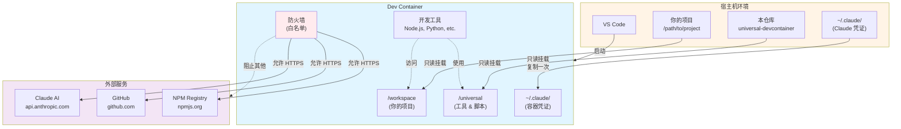

# Universal Dev Container — Claude Code 开发环境

> 可复用的 Dev Container 配置，集成 Claude Code、防火墙和代理支持。
> ⚠️ 默认启用 **bypassPermissions** 模式 — 请查看[安全提醒](#安全提醒-)了解使用限制。

**语言 / Languages**: [中文](README.md) | [English](README.en.md)

## 这是什么？

这是一个预配置的开发容器环境，包含：
- ✅ **Claude Code** — AI 编程助手（已配置登录和权限）
- ✅ **开发工具** — Node.js (LTS)、Python 3.12、GitHub CLI
- ✅ **网络安全** — 基于白名单的出站防火墙
- ✅ **代理支持** — VPN/企业代理透传
- ✅ **可复用** — 一份配置，用于所有项目

---

## 📋 快速参考

<details open>
<summary><b>常用命令速查</b></summary>

```bash
# 快速启动（推荐）
/path/to/universal-devcontainer/scripts/open-project.sh /path/to/your/project

# 验证安装
claude /doctor                    # 检查 Claude Code 状态
claude /permissions               # 查看权限模式
node -v && python3 --version      # 检查开发工具

# 故障排查
echo $PROJECT_PATH                # 检查项目路径是否设置
grep ' /workspace ' /proc/mounts  # 验证工作区挂载（容器内）
```

**关键路径**:
- 你的项目: `/workspace`
- 工具脚本: `/universal`
- Claude 配置: `~/.claude/settings.json`

**快速跳转**:
- [快速开始](#快速开始-) | [故障排查](#故障排查) | [安全提醒](#安全提醒-) | [性能优化](#-性能优化)
</details>

---

## 先决条件

- VS Code ≥ 1.105 + Dev Containers 扩展 ≥ 0.427
- Docker Desktop 已启动
- （可选）`npm i -g @devcontainers/cli` — 用于脚本辅助

**受限网络/代理环境**：先阅读 [代理配置指南](docs/PROXY_SETUP.md)

---

## 🏗️ 架构概览

<details>
<summary><b>查看系统架构图</b></summary>



**关键特性**：
- 🔒 **只读挂载**: 宿主机文件安全保护
- 🔑 **凭证复制**: 一次性从宿主机复制到容器
- 🛡️ **防火墙**: 白名单控制所有出站流量
- 🚀 **工具隔离**: 容器内环境不影响宿主机

</details>

---

## 快速开始 🚀

**选择适合你的方式**：
- **方法 1**（共享配置）：多个项目复用同一个配置 — 适合临时开发、快速试用
- **方法 2**（独立配置）：每个项目有自己的配置 — 适合新项目、团队协作

---

### 方法 1：共享配置模式（推荐用于临时开发）⭐

使用本仓库为多个项目提供统一的 Dev Container 环境。

**快速开始**：
```bash
# 1. 在宿主机安装并登录 Claude Code（仅需一次）
npm i -g @anthropic-ai/claude-code
claude login

# 2. 为任意项目打开容器
/path/to/universal-devcontainer/scripts/open-project.sh /path/to/your/project

# 或从 Git 仓库直接克隆并开发
/path/to/universal-devcontainer/scripts/open-project.sh https://github.com/owner/repo.git
```

**工作原理**：
1. 脚本自动设置 `PROJECT_PATH` 环境变量
2. VS Code 在容器中挂载你的项目到 `/workspace`
3. 本仓库工具挂载到 `/universal`

<details>
<summary><b>方法 1 替代方案</b>（不使用脚本）</summary>

**手动设置环境变量**：
```bash
export PROJECT_PATH=/path/to/your/project
code /path/to/universal-devcontainer
# 在 VS Code 中：Dev Containers: Reopen in Container
```

**开发本容器自身**：
```bash
/path/to/universal-devcontainer/scripts/open-project.sh /path/to/universal-devcontainer
```
</details>

---

### 方法 2：独立配置模式（推荐用于新项目）📦

**适用场景**：为新项目创建独立的 Dev Container 配置

从 v2.1.0 开始，本项目提供了 **Dev Container Template**，让你可以快速为自己的项目生成配置，而无需依赖本仓库。

**使用步骤**：

1. 在 VS Code 中打开你的项目
2. 按 `Cmd/Ctrl + Shift + P` 打开命令面板
3. 选择 "Dev Containers: Add Dev Container Configuration Files..."
4. 选择 "Show All Definitions..."
5. 搜索并选择 "Universal Dev Container with Claude Code"
6. 配置选项：
   - **Claude Login Method**: `host` (推荐) / `api-key` / `manual`
   - **Enable Firewall**: `true` (默认，启用白名单防火墙) / `false`
   - **Strict Proxy Mode**: `true` / `false` (默认，是否强制所有流量走代理)
   - **Timezone**: 你的时区 (如 `Asia/Shanghai`、`UTC`)
   - **Enable Sandbox**: `true` / `false` (默认，是否启用命令沙箱)
   - **Bypass Permissions**: `true` (默认，自动批准操作) / `false` (需手动批准)
7. 按 "Reopen in Container"

**模板特点**：
- ✅ 项目内配置（`.devcontainer/` 目录在你的项目里）
- ✅ 可自定义选项（通过 UI 配置，无需手动编辑）
- ✅ 独立性强（不依赖本仓库）
- ✅ 适合分享（团队成员直接 clone 即可使用）

**手动配置方式**（不使用 UI）：

在项目根目录创建 `.devcontainer/devcontainer.json`：

```json
{
  "name": "My Project",
  "image": "ghcr.io/xrf9268-hue/universal-devcontainer:latest",
  "remoteEnv": {
    "PROJECT_PATH": "${localWorkspaceFolder}"
  }
}
```

**Template vs 本仓库方式对比**：

| 特性 | 本仓库方式 (方法1-3) | Dev Container Template (方法4) |
|------|---------------------|-------------------------------|
| 适用场景 | 临时开发、多项目共享配置 | 新项目、团队协作 |
| 配置位置 | 本仓库 | 项目内 `.devcontainer/` |
| 灵活性 | 手动编辑环境变量 | UI 配置选项 |
| 项目依赖 | 需要本仓库 | 独立（配置在项目里） |
| 更新方式 | git pull 本仓库 | 重新应用模板或手动更新 |

📖 **Template 完整文档**: 见 [`src/universal-claude/README.md`](src/universal-claude/README.md)

---

## 验证安装

容器启动后，打开终端验证：

```bash
# 验证已自动复用宿主机登录
claude /doctor

# 检查 Claude Code
claude /help
/permissions          # 应显示 bypassPermissions

# 检查开发工具
node -v               # LTS 版本
python3 --version     # 3.12.x (Ubuntu 24.04)
gh --version          # GitHub CLI

# 检查代理（如已配置）
env | grep -i proxy
nc -vz host.docker.internal 1082  # 测试宿主代理连通性
```

---

## 环境变量配置

### 登录和组织配置（可选）

默认情况下，只要在宿主机执行过 `claude login`，容器会在初始化时从宿主机 `~/.claude/settings.json` 复制登录配置到容器内部，一般 **无需额外环境变量**。

如需覆盖登录方式或使用纯 API Key 模式，可以设置：

| 变量 | 说明 | 示例 |
|------|------|------|
| `CLAUDE_LOGIN_METHOD` | 登录方式：`console`/`claudeai`/`apiKey` | `console` |
| `ANTHROPIC_API_KEY` | API Key（用 `apiKey` 方式时必需） | `sk-ant-xxx...` |

在宿主机设置（容器会自动读取）：

```bash
# 方式 1：环境变量
export CLAUDE_LOGIN_METHOD=console
export ANTHROPIC_API_KEY=sk-ant-...

# 方式 2：VS Code settings.json
// ~/.config/Code/User/settings.json
{
  "dev.containers.defaultEnv": {
    "CLAUDE_LOGIN_METHOD": "console",
    "ANTHROPIC_API_KEY": "sk-ant-..."
  }
}
```

### 可选变量

| 变量 | 说明 | 默认值 | 示例 |
|------|------|--------|------|
| `CLAUDE_ORG_UUID` | 强制使用指定组织 | - | `org-xxx...` |
| `HOST_PROXY_URL` | 宿主机 HTTP/HTTPS 代理 | - | `http://host.docker.internal:7890` |
| `ALL_PROXY` | 宿主机 SOCKS 代理 | - | `socks5h://host.docker.internal:1080` |
| `NO_PROXY` | 不走代理的地址 | - | `localhost,127.0.0.1,.local` |
| `EXTRA_ALLOW_DOMAINS` | 防火墙额外白名单 | - | `"gitlab.com myapi.com"` |
| `ALLOW_SSH_ANY` | 允许任意 SSH 连接 | `0` | `1` |
| `STRICT_PROXY_ONLY` | 仅允许代理访问（严格模式） | `1` | `0` |
| `ENABLE_CLAUDE_SANDBOX` | Claude 沙箱模式 | - | `1` |

**代理配置详细说明**：见 [docs/PROXY_SETUP.md](docs/PROXY_SETUP.md)

## ⚠️ 安全与凭证共享

本配置通过**只读挂载 + 一次性复制**的方式共享宿主机登录信息：

1. **无需在容器内登录**：容器首次创建时从宿主机 `~/.claude/settings.json` 读取登录配置，复制到容器内部 `/home/vscode/.claude/settings.json`。
2. **会话失效处理**：如提示 Token 过期，请在宿主机终端执行 `claude login`，然后在 VS Code 中执行 “Rebuild Without Cache” 重新创建容器，以重新复制最新登录状态。
3. **不回写宿主配置**：容器内的 `bootstrap-claude.sh` 只会写入容器自己的 `/home/vscode/.claude/settings.json`，不会修改宿主机 `~/.claude`，降低凭证被意外更改的风险。

---

## 模式切换

默认使用 **bypass 模式**（无人工确认）。如需更安全的模式，请手动编辑 `~/.claude/settings.json`：

```jsonc
{
  "permissions": {
    // 更安全：需要确认编辑
    "defaultMode": "acceptEdits",
    // 可选：彻底禁用绕过模式（企业更严策略）
    "disableBypassPermissionsMode": "disable"
  }
}
```

---

## 防火墙白名单

容器默认**拒绝所有出站连接**，仅允许以下域名的 HTTPS (443) 连接：

**基础白名单**：
- `registry.npmjs.org` / `npmjs.org` — npm 包管理
- `github.com` / `api.github.com` / `objects.githubusercontent.com` — GitHub
- `claude.ai` / `api.anthropic.com` / `console.anthropic.com` — Claude Code
- DNS 服务器（UDP/TCP 53）
- GitHub SSH（22 端口，除非 `ALLOW_SSH_ANY=1`）

**扩展白名单**：

```bash
export EXTRA_ALLOW_DOMAINS="gitlab.mycompany.com registry.internal.net"
```

防火墙会额外放行这些域名。

**严格代理模式**（`STRICT_PROXY_ONLY=1`）：
- 仅放行 DNS 和代理端口
- 所有外网访问必须走代理
- 适用于高安全要求的受限网络

---

## 内置功能

### 预装插件
- `commit-commands` — 提交辅助
- `pr-review-toolkit` — PR 审查
- `security-guidance` — 安全指导

#### 🚀 高级插件（可选）

从 v2.2.0 开始，我们提供 **`claude-code-plugins` Feature**，支持来自社区市场的 9 个高级插件：

**安装方式**：在 `.devcontainer/devcontainer.json` 中添加：

```json
{
  "features": {
    "ghcr.io/xrf9268-hue/features/claude-code:1": {},
    "ghcr.io/xrf9268-hue/features/claude-code-plugins:1": {
      "installPlugins": "essential"
    }
  }
}
```

**可用插件集**：
- **essential**（推荐）：commit-commands, code-review, security-guidance, context-preservation
- **all**：全部 9 个插件
- **development**：agent-sdk-dev, feature-dev, plugin-developer-toolkit
- **review**：code-review, pr-review-toolkit
- **security**：security-guidance
- **custom**：自定义插件列表

**插件列表**：
1. **agent-sdk-dev** - Claude Agent SDK 开发工具
2. **commit-commands** - Git 工作流自动化
3. **code-review** - 自动化 PR 审查（置信度评分）
4. **feature-dev** - 7 阶段结构化功能开发
5. **security-guidance** - 主动安全警告（17 条规则）
6. **context-preservation** - 自动保存上下文
7. **frontend-dev-guidelines** - React/TypeScript 最佳实践
8. **pr-review-toolkit** - 6 个专业审查代理
9. **plugin-developer-toolkit** - 创建你自己的插件

**详细文档**：见 [`src/features/claude-code-plugins/README.md`](src/features/claude-code-plugins/README.md)

**插件故障排查**：如果 `/doctor` 显示插件 "not found in marketplace"：

```bash
# 重新运行 bootstrap 脚本
bash .devcontainer/bootstrap-claude.sh

# 验证
claude /plugins marketplaces        # 应显示 claude-code-plugins
claude /plugins search commit-commands
```

### 自定义命令和技能
- `/review-pr <PR编号>` — 分析 GitHub PR
- `reviewing-prs` skill — 代码审查 AI 技能

### 端口转发
默认转发：`3000`, `5173`, `8000`, `9003`, `1024`, `4444`

### 预装工具
- **开发工具**：Node.js (LTS), Python 3.12, GitHub CLI
- **系统工具**：git, curl, jq, iptables, dnsutils, netcat

---

## 目录结构

```
universal-devcontainer/
├── .devcontainer/
│   ├── devcontainer.json       # 主配置（通过 mounts 绑定 /workspace 与 /universal）
│   ├── Dockerfile              # 基础镜像
│   ├── bootstrap-claude.sh     # Claude Code 安装
│   ├── init-firewall.sh        # 防火墙规则
│   └── setup-proxy.sh          # 代理配置
├── scripts/
│   ├── open-project.sh         # 挂载外部项目到容器（设置 PROJECT_PATH）
│   ├── validate-all.sh         # 验证套件
│   ├── test-container.sh       # 容器测试
│   └── security-scan.sh        # 安全扫描
├── .claude/
│   └── settings.local.json     # 项目级权限配置
├── docs/
│   ├── PROXY_SETUP.md          # 代理配置详细指南
│   ├── SECURITY.md             # 安全策略和最佳实践
│   └── SECURITY_AUDIT.md       # 安全审计报告
└── .github/
    └── workflows/              # CI/CD 流水线
```

---

## ⚡ 性能优化

### 使用预构建镜像（推荐）

从 v2.1.0 开始，我们提供**预构建容器镜像**，可大幅提升启动速度。

**性能对比**：

| 方式 | 首次启动 | 后续启动 |
|------|---------|---------|
| 从 Dockerfile 构建 | ~10 分钟 | ~30 秒 |
| 预构建镜像 | ~1 分钟（拉取） | ~5 秒 |

**提升**: 首次启动快 70%，后续启动快 80%

**使用方法**：

在你的项目中创建 `.devcontainer/devcontainer.json`：

```json
{
  "name": "My Project",
  "image": "ghcr.io/xrf9268-hue/universal-devcontainer:latest",
  "remoteEnv": {
    "PROJECT_PATH": "${localWorkspaceFolder}"
  }
}
```

**镜像标签**：
- `latest` - 最新稳定版（推荐）
- `2.1`, `2` - 特定版本（固定版本）
- `main` - 开发版本（main 分支）

**支持架构**：
- `linux/amd64` (Intel/AMD)
- `linux/arm64` (Apple Silicon, ARM 服务器)

**完整示例**: 见 [`examples/prebuilt-image/`](examples/prebuilt-image/)

---

## 故障排查

### 启动问题

#### "Workspace does not exist" 错误

**现象**：容器启动失败，提示工作区挂载错误。

**原因**：VS Code 进程未继承 `PROJECT_PATH`，或 Docker Desktop 未共享该路径。

**解决方法**：
- **推荐**：使用脚本 `scripts/open-project.sh /path/to/your/project`（自动设置环境）
- **手动**：从终端执行 `export PROJECT_PATH=/path/to/your/project && code /path/to/universal-devcontainer`
- **持久化**：配置 VS Code 用户设置：
  ```jsonc
  {
    "dev.containers.defaultEnv": { "PROJECT_PATH": "/path/to/your/project" }
  }
  ```

**macOS 专用**：
- Docker Desktop → Settings → Resources → File Sharing
- 确保父目录已共享（如 `/Users`）

**快速自检**：
- 宿主机：`echo $PROJECT_PATH && test -d "$PROJECT_PATH" && echo OK || echo MISSING`
- 容器内：查看 MOTD 横幅或 `grep ' /workspace ' /proc/mounts`

---

### 认证问题

#### Claude Code 登录失败（OAuth 回调）

**现象**：浏览器授权页点击 Authorize 后无限转圈。

**根本原因**：OAuth 回调端口未从容器转发到宿主机。

**快速检查清单**：
- ✓ VS Code "PORTS" 面板显示回调端口（如 41521）已转发到 localhost
- ✓ 宿主机代理绕行包含：`localhost, 127.0.0.1, ::1, host.docker.internal`
- ✓ 测试回调服务：`curl http://127.0.0.1:<port>/`（应返回 404）

**解决方法**：
1. **自动转发**（通常自动生效）：
   - 容器已启用 `remote.autoForwardPorts=true`
   - VS Code 在服务监听时自动转发

2. **手动转发**（自动转发失败时）：
   - 从授权 URL 记录端口号（如 `http://localhost:63497/callback`）
   - VS Code → PORTS 面板 → Forward Port → 输入端口号

3. **替代登录方式**（绕过浏览器）：
   - 设置 `CLAUDE_LOGIN_METHOD=console` + `ANTHROPIC_API_KEY=sk-ant-...`
   - 使用 API 密钥认证

**代理配置**：详见 [docs/PROXY_SETUP.md](docs/PROXY_SETUP.md) 代理绕行设置。

---

### 网络问题

#### 容器无法访问外网

**检查清单**：
1. **防火墙阻止域名？**
   - 添加到 `EXTRA_ALLOW_DOMAINS="gitlab.com myapi.com"`

2. **企业代理环境？**
   - 配置 `HOST_PROXY_URL=http://host.docker.internal:7890`
   - 详见 [docs/PROXY_SETUP.md](docs/PROXY_SETUP.md)

3. **Docker 文件共享**（macOS）：
   - Docker Desktop → Resources → File Sharing
   - 确保包含 `/Users`

---

### 插件和扩展问题

#### Claude Code 插件找不到

**现象**：`/doctor` 显示插件 "not found in marketplace"

**解决方法**：
```bash
# 验证市场配置
claude /plugins marketplaces  # 应显示 claude-code-plugins

# 重新运行 bootstrap 脚本
bash .devcontainer/bootstrap-claude.sh

# 测试网络连接
curl -I https://api.github.com
```

---

### 权限问题

#### 路径权限错误（macOS/Linux）

**现象**：无法访问项目文件，权限被拒绝

**解决方法**：
```bash
# 确保父目录可遍历
chmod o+rx /Users/<username>
chmod o+rx /Users/<username>/developer
chmod o+rx /Users/<username>/developer/<project>
```

---

## 安全提醒 ⚠️

### Bypass Permissions 模式

**默认配置**：本容器默认启用 `bypassPermissions` 模式（自动批准所有操作）。

**⚠️ 重要限制**：
- ✅ **适用场景**：个人可信项目、隔离开发环境
- ❌ **不适用**：不可信代码、安全审计、协作项目

**切换到更安全模式**：
编辑 `~/.claude/settings.json`：
```jsonc
{
  "permissions": {
    "defaultMode": "acceptEdits",  // 仅自动批准读取，写入需确认
    // 或完全禁用绕过模式（企业策略）
    "disableBypassPermissionsMode": "disable"
  }
}
```

详见[模式切换](#模式切换)章节了解更多安全选项。

### 网络安全

- **防火墙白名单**：默认拒绝所有出站连接，仅白名单域名可访问
- **敏感文件保护**：自动保护 `.env*`, `secrets/**`, `id_rsa`, `id_ed25519`
- **容器权限**：需要 `--cap-add=NET_ADMIN` 权限管理防火墙

### 凭证共享安全

- 宿主机凭证以**只读**方式挂载
- 容器内修改**不会回写**到宿主机
- Token 过期时需在宿主机重新登录

更多安全最佳实践，请参阅 [docs/SECURITY.md](docs/SECURITY.md)

---

## 常见使用场景

### 场景 1：快速试用（临时项目）
→ 使用**方法 1**（UI 流程），无需创建任何文件

### 场景 2：团队协作项目
→ 使用**方法 2**（项目配置），提交 `.devcontainer/devcontainer.json` 到代码库

### 场景 3：多个个人项目
→ 使用**方法 3**（脚本辅助），快速为每个项目生成配置

### 场景 4：企业受限网络
→ 先配置代理（见 [docs/PROXY_SETUP.md](docs/PROXY_SETUP.md)），然后使用任一方法

---

---

## 📚 框架示例和工具集

### 框架使用示例

我们提供了 **7 个完整的框架示例**，展示如何将 Universal Dev Container 与流行框架结合使用：

**前端框架**:
- **[React + TypeScript](examples/react-app/)** - Vite + React 18，热模块替换
- **[Next.js 15](examples/nextjs-app/)** - App Router + 服务器组件

**后端框架**:
- **[Node.js + Express](examples/nodejs-express/)** - TypeScript API，支持热重载
- **[Python + FastAPI](examples/python-fastapi/)** - 高性能异步 API，自动文档
- **[Python + Django](examples/python-django/)** - 完整 Web 框架，内置 ORM
- **[Go + Gin](examples/go-app/)** - 高性能 Go Web 服务

每个示例包含：
- ✅ 完整的 `.devcontainer` 配置
- ✅ 可运行的示例代码
- ✅ Claude Code 集成
- ✅ 框架特定的 VS Code 扩展
- ✅ 详细的 README 和使用说明

**查看所有示例**: [examples/README.md](examples/README.md)

### Claude Code 权限模式

提供 **4 种预设权限模式**，适应不同信任级别的项目：

| 模式 | 说明 | 适用场景 |
|------|------|----------|
| **ultra-safe** | 所有操作需批准 | 不可信代码、安全审计 |
| **safe** (推荐) | 允许读取，写入需批准 | 一般开发、协作项目 |
| **dev** | 绕过所有权限 | 个人可信项目 |
| **review** | 只读模式 | 代码审查、文档生成 |

**快速切换模式**:
```bash
# 交互式选择
scripts/configure-claude-mode.sh

# 直接应用
scripts/configure-claude-mode.sh safe
scripts/configure-claude-mode.sh dev

# 查看当前模式
scripts/configure-claude-mode.sh status
```

预设文件位置: `.claude/presets/`

### 可选工具集 Features

提供 **5 个功能 Features**，按需安装常用工具和插件：

#### 🔌 Claude Code 高级插件 (claude-code-plugins)
```json
{
  "features": {
    "ghcr.io/xrf9268-hue/features/claude-code-plugins:1": {
      "installPlugins": "essential"  // essential/all/development/review/security/custom/none
    }
  }
}
```
包含: 9 个社区插件，涵盖开发、审查、安全等功能

详见: [src/features/claude-code-plugins/README.md](src/features/claude-code-plugins/README.md)

#### 🛠️ 开发工具集 (toolset-devtools)
```json
{
  "features": {
    "ghcr.io/xrf9268-hue/features/toolset-devtools:1": {
      "includeTools": "all"  // all/essential/minimal
    }
  }
}
```
包含: `lazygit`, `bat`, `fzf`, `httpie`, `ripgrep`, `eza`, `delta`

#### 🗄️ 数据库工具集 (toolset-database)
```json
{
  "features": {
    "ghcr.io/xrf9268-hue/features/toolset-database:1": {}
  }
}
```
包含: `pgcli`, `mycli`, `redis-cli`, `mongosh`, `litecli`

#### ☁️ 云平台工具集 (toolset-cloud)
```json
{
  "features": {
    "ghcr.io/xrf9268-hue/features/toolset-cloud:1": {
      "installGcloud": true,
      "installAzureCli": true
    }
  }
}
```
包含: `aws`, `gcloud`, `az`, `doctl`

#### ⚙️ Kubernetes 工具集 (toolset-kubernetes)
```json
{
  "features": {
    "ghcr.io/xrf9268-hue/features/toolset-kubernetes:1": {}
  }
}
```
包含: `kubectl`, `helm`, `k9s`, `kubectx`, `kustomize`, `skaffold`


## 🚀 高级功能（Phase 5）

### 多容器架构

支持复杂的多服务应用，使用 Docker Compose 编排多个容器：

**示例 1: [全栈应用](examples/multi-container/fullstack/)**
- **技术栈**: React + FastAPI + PostgreSQL + Redis
- **服务**: 前端、后端、数据库、缓存
- **适用**: Web 应用、SaaS 平台

**示例 2: [微服务架构](examples/multi-container/microservices/)**
- **技术栈**: Node.js + Python + Go + PostgreSQL + RabbitMQ
- **服务**: API网关 + 3个微服务 + 消息队列 + 服务发现
- **适用**: 大型企业应用、分布式系统

[查看多容器示例 →](examples/multi-container/README.md)

### 项目模板生成器

一键创建新项目，预配置 Dev Container：

```bash
# 交互式创建
scripts/create-project.sh

# 直接创建
scripts/create-project.sh my-app react-ts
scripts/create-project.sh my-api fastapi
scripts/create-project.sh my-stack fullstack
```

**可用模板**:
- react-ts, nextjs (前端)
- express-ts, fastapi, django, go-gin (后端)
- fullstack, microservices (复杂架构)

### 企业合规功能

#### 审计日志 (audit-logging)
```json
{
  "features": {
    "ghcr.io/xrf9268-hue/features/audit-logging:1": {
      "retentionDays": 90,
      "enableSIEM": false
    }
  }
}
```
- 记录所有文件操作、网络请求、命令执行
- SOC 2, ISO 27001, HIPAA 合规
- JSON 格式，可集成 SIEM 系统

#### 离线模式 (offline-mode)
```json
{
  "features": {
    "ghcr.io/xrf9268-hue/features/offline-mode:1": {
      "blockAllExternal": true
    }
  }
}
```
- 完全阻断外网访问（气隙环境）
- ITAR, 涉密项目合规
- 本地服务正常工作

#### GDPR 合规 (compliance-gdpr)
```json
{
  "features": {
    "ghcr.io/xrf9268-hue/features/compliance-gdpr:1": {
      "enablePIIDetection": true,
      "dataRetentionDays": 30
    }
  }
}
```
- PII 检测、数据加密
- 数据擦除（被遗忘权）
- 数据导出（可移植性）
- GDPR Article 5, 17, 20 合规

[查看合规功能详情 →](src/features/)

## 🌍 社区与生态系统（Phase 6）

### 贡献指南和规范

我们欢迎所有形式的贡献！无论是报告 Bug、提出新功能、改进文档还是提交代码。

#### 📖 核心文档

- **[贡献指南](CONTRIBUTING.md)** - 完整的开发工作流、代码规范、测试清单
- **[行为准则](CODE_OF_CONDUCT.md)** - 社区行为规范（基于 Contributor Covenant 2.1）
- **[社区指南](COMMUNITY.md)** - 如何参与社区、沟通渠道、项目目标

#### 🔧 开发工具

**Git 钩子**：
```bash
# 安装 pre-commit 钩子（推荐）
./scripts/install-hooks.sh

# 钩子会自动验证：
# ✓ JSON 文件格式（jq empty）
# ✓ Shell 脚本语法（bash -n）
# ✓ ShellCheck 警告
# ✓ 潜在的敏感信息
# ✓ 大文件检测
```

**.editorconfig**：
- 统一代码格式（所有编辑器通用）
- JSON/YAML 2空格缩进
- Shell 脚本 4空格缩进
- 自动去除行尾空格

#### 📝 Issue 和 PR 模板

**Issue 模板**：
- 🐛 [Bug Report](.github/ISSUE_TEMPLATE/bug_report.md) - 详细的 Bug 报告模板
- 💡 [Feature Request](.github/ISSUE_TEMPLATE/feature_request.md) - 功能请求模板
- 📋 [配置](.github/ISSUE_TEMPLATE/config.yml) - 引导用户到 Discussions/Security

**PR 模板**：
- ✅ [Pull Request Template](.github/PULL_REQUEST_TEMPLATE.md)
- 包含类型、测试清单、安全检查
- 自动化的验证流程

### GitHub Discussions

我们使用 GitHub Discussions 作为主要的社区平台：

**分类**：
- 📢 **Announcements** - 发布公告、重要更新
- 💡 **Ideas & Feature Requests** - 功能建议和讨论
- 🙋 **Q&A** - 提问和获取帮助
- 🎨 **Show and Tell** - 分享你的项目和配置
- 🔧 **Development & Contributing** - 开发讨论
- 💬 **General** - 一般性讨论

[加入 Discussions →](https://github.com/xrf9268-hue/universal-devcontainer/discussions)

### 视频教程计划

我们正在制作视频教程系列，帮助用户快速上手：

**初级教程**（计划中）：
1. Universal Dev Container 入门（5-7分钟）
2. Claude Code 集成基础（8-10分钟）
3. 创建第一个项目（10-12分钟）

**中级教程**（计划中）：
4. 框架示例详解（12-15分钟）
5. 权限模式深入（10-12分钟）
6. 多容器开发（15-18分钟）

**高级教程**（计划中）：
7. 自定义 Dev Container Features（12-15分钟）
8. 企业合规功能（15-18分钟）
9. 防火墙和网络安全（10-12分钟）
10. 参与项目贡献（8-10分钟）

[查看完整教程计划 →](docs/VIDEO_TUTORIALS.md)

### 如何贡献

#### 🎨 添加框架示例
```bash
# 1. 创建示例目录
mkdir -p examples/your-framework/{.devcontainer,src}

# 2. 添加 devcontainer.json
# 参考现有示例

# 3. 编写 README.md
# 说明如何使用这个示例

# 4. 提交 PR
```

#### 🔧 创建 Dev Container Feature
```bash
# 1. 创建 Feature 结构
mkdir -p src/features/your-feature
cd src/features/your-feature

# 2. 创建必需文件
# - devcontainer-feature.json（元数据）
# - install.sh（安装脚本）
# - README.md（文档）

# 3. 测试 Feature
# 在 devcontainer.json 中引用测试

# 4. 提交 PR
```

#### 📝 改进文档
- 修复错别字和错误
- 添加示例和截图
- 澄清混淆的部分
- 翻译到其他语言

#### 🐛 报告 Bug
使用 [Bug Report 模板](https://github.com/xrf9268-hue/universal-devcontainer/issues/new?template=bug_report.md)

#### 💡 提出功能
使用 [Feature Request 模板](https://github.com/xrf9268-hue/universal-devcontainer/issues/new?template=feature_request.md)

[查看完整贡献指南 →](CONTRIBUTING.md)

## 🔄 更新和维护

### 增量更新（无需重建容器）

从 v2.1.0 开始，支持**容器内增量更新**，无需重建容器。

**快速更新**：
```bash
# 检查更新
check-updates

# 应用更新
update-devcontainer

# 如有问题，回滚
rollback-devcontainer
```

**支持更新的内容**：
- ✅ 配置文件（`.devcontainer/*`）
- ✅ 脚本文件（`scripts/*`）
- ✅ Claude Code CLI（可选）
- ✅ Claude Code 插件（可选）
- ✅ 文档和版本跟踪

**性能**：
- 配置更新：~10 秒
- 包含 Claude CLI 更新：~1-2 分钟
- 自动备份，支持一键回滚

**详细文档**：见 [`docs/UPDATES.md`](docs/UPDATES.md)

---

## 更新日志

### v2.0.0（简化版本）— 2025-01

**重大变更**（提升易用性）：
- ✅ 使用 **workspaceMount** 动态挂载项目（不再依赖 extends）
- ✅ 简化脚本逻辑（从 71 行减少到 65 行）
- ✅ 删除所有不稳定的 extends 相关代码
- ✅ 一个容器服务所有项目

---

## 参考资料

- [VS Code Dev Containers 官方文档](https://code.visualstudio.com/docs/devcontainers/containers)
- [Dev Container 规范](https://containers.dev/)
- [Claude Code 文档](https://code.claude.com/docs)

## 许可证

MIT License — 详见 `LICENSE` 文件

---

**版本**: 2.0.0
**最后更新**: 2025-11-23
